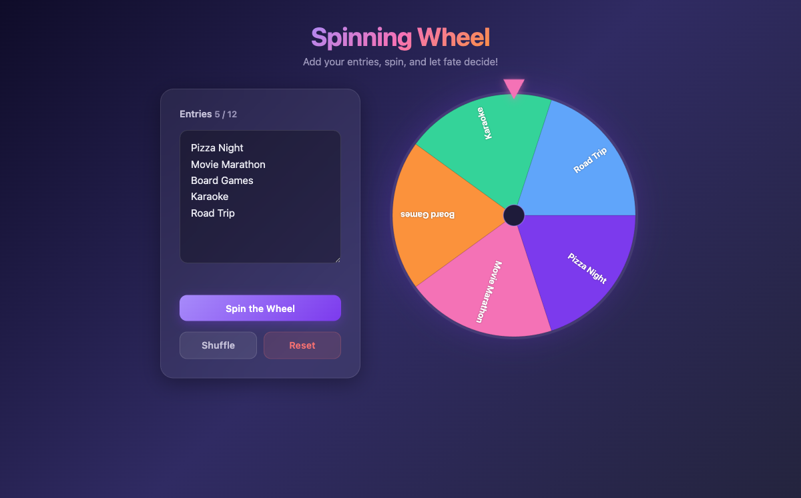

<div align="center">

# Spinning Wheel

[](https://developer.mozilla.org/en-US/docs/Web/HTML)
[](https://developer.mozilla.org/en-US/docs/Web/CSS)
[](https://developer.mozilla.org/en-US/docs/Web/JavaScript)
[](https://opensource.org/licenses/MIT)
[](https://alfredang.github.io/spinning-wheel/)

**A modern, aesthetic spinning wheel web app — add entries, spin, and let fate decide!**

[Live Demo](https://alfredang.github.io/spinning-wheel/) · [Report Bug](https://github.com/alfredang/spinning-wheel/issues) · [Request Feature](https://github.com/alfredang/spinning-wheel/issues)

</div>

## Screenshot



## About

Spinning Wheel is a sleek, zero-dependency web app that lets you create customizable spinning wheels for random selection. Whether you're picking a restaurant, choosing a game, or making any group decision — just type your entries, spin, and enjoy the animated result with sound effects and confetti.

### Key Features

- **3–12 customizable entries** — type one per line, add/edit/remove freely
- **Smooth spin animation** — cubic ease-out deceleration with realistic motion
- **Sound effects** — tick sounds during spin and a celebratory chord on win
- **Confetti celebration** — particle burst when the winner is selected
- **Shuffle & Reset** — randomize entry order or restore defaults
- **Responsive design** — works on desktop and mobile
- **Glassmorphism UI** — dark gradient background with frosted glass cards

## Tech Stack

| Category | Technology |
|----------|------------|
| **Markup** | HTML5 |
| **Styling** | CSS3 (Glassmorphism, Gradients, Animations) |
| **Rendering** | HTML5 Canvas |
| **Audio** | Web Audio API |
| **Deployment** | GitHub Pages |

## Architecture

```
┌───────────────────────────────────────┐
│            Browser (Client)           │
├───────────────────────────────────────┤
│  index.html                           │
│  ┌─────────────┐  ┌────────────────┐  │
│  │  Controls    │  │  Canvas Wheel  │  │
│  │  (textarea,  │  │  (drawWheel,   │  │
│  │   buttons)   │  │   animation)   │  │
│  └──────┬───────┘  └───────┬────────┘  │
│         │                  │           │
│         ▼                  ▼           │
│  ┌─────────────────────────────────┐   │
│  │         script.js               │   │
│  │  ┌─────────┐ ┌──────────────┐   │   │
│  │  │ Web     │ │ Confetti     │   │   │
│  │  │ Audio   │ │ Particles    │   │   │
│  │  └─────────┘ └──────────────┘   │   │
│  └─────────────────────────────────┘   │
├───────────────────────────────────────┤
│  style.css (Glassmorphism Theme)      │
└───────────────────────────────────────┘
```

## Project Structure

```
spinning-wheel/
├── index.html          # Main HTML structure
├── style.css           # Glassmorphism theme & responsive layout
├── script.js           # Wheel rendering, animation, audio & confetti
├── screenshot.png      # App screenshot for README
└── README.md           # Project documentation
```

## Getting Started

### Prerequisites

- Any modern web browser (Chrome, Firefox, Safari, Edge)

### Installation

1. **Clone the repository**
   ```bash
   git clone https://github.com/alfredang/spinning-wheel.git
   ```

2. **Navigate to the project**
   ```bash
   cd spinning-wheel
   ```

3. **Open in browser**
   ```bash
   open index.html
   ```

No build step, no dependencies — just open and spin!

## Deployment

### GitHub Pages

This project is deployed automatically via GitHub Pages. Any push to the `main` branch updates the live site.

**Live URL:** [https://alfredang.github.io/spinning-wheel/](https://alfredang.github.io/spinning-wheel/)

### Self-Hosting

Simply serve the project directory with any static file server:

```bash
# Using Python
python -m http.server 8000

# Using Node.js (npx)
npx serve .
```

## Contributing

Contributions are welcome! Here's how:

1. **Fork** the repository
2. **Create** a feature branch (`git checkout -b feature/amazing-feature`)
3. **Commit** your changes (`git commit -m 'Add amazing feature'`)
4. **Push** to the branch (`git push origin feature/amazing-feature`)
5. **Open** a Pull Request

For major changes, please open an [issue](https://github.com/alfredang/spinning-wheel/issues) or start a [discussion](https://github.com/alfredang/spinning-wheel/discussions) first.

## Developed By

**Tertiary Infotech Academy Pte. Ltd.**

## Acknowledgements

- Glassmorphism design inspiration from modern UI trends
- Color palette curated for accessibility and visual contrast
- Web Audio API for zero-dependency sound synthesis

---

<div align="center">

If you found this useful, please consider giving it a ⭐

</div>

## License

MIT
